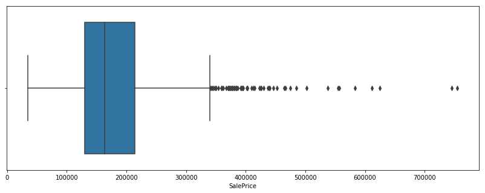
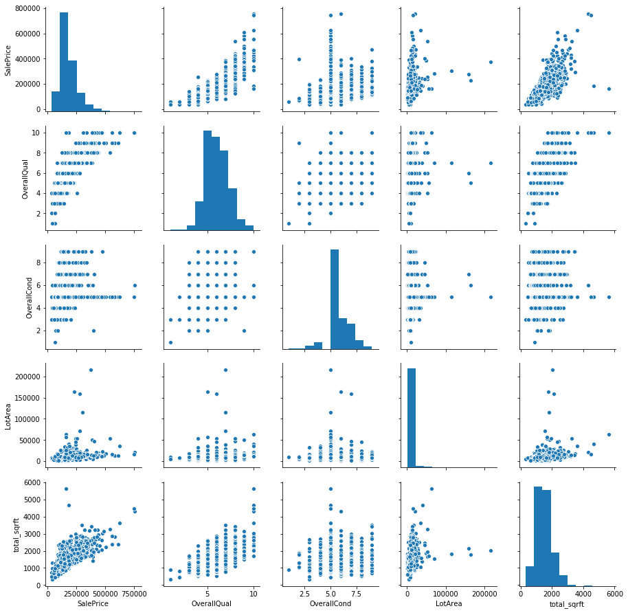
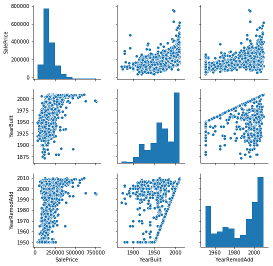
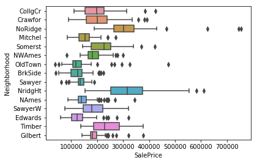

**[Bernardo Romero - 4.4.2020](https://github.com/bromero26)**

---


# Machine Learning model - Estimate Housing Prices


Data from the [Housing Prices Competition for Kaggle Learn Users](https://www.kaggle.com/c/home-data-for-ml-course). 
As part of the [Intermediate Machine Learning Home Page](https://www.kaggle.com/learn/intermediate-machine-learning)


This model is my first attempt at machine learning. In the notebook I built upon what is taught in the Kaggle micro-course listed above and tweaked parameters, functions and exploratory analysis in order to achieve better performance. My goal was to develop a first understanding of key ML concepts and to get interested in moving-up the leaderboard of Kaggle competitions.  


# Step 1: Read and explore data, prepare training and validations datasets

## Read the data


```python
import pandas as pd
from sklearn.model_selection import train_test_split
from sklearn.compose import ColumnTransformer
from sklearn.pipeline import Pipeline
from sklearn.impute import SimpleImputer
from sklearn.preprocessing import OneHotEncoder
from sklearn.ensemble import RandomForestRegressor
from sklearn.tree import DecisionTreeRegressor
from sklearn.metrics import mean_absolute_error

#Read the data
X_full = pd.read_csv('train.csv', index_col='Id')
X_test_full = pd.read_csv('test.csv', index_col='Id')
print( 'The full dataset has {} rows and {} columns.'.format(X_full.shape[0], X_full.shape[1]))
```

    The full dataset has 1460 rows and 80 columns.
    

## Exploratory Data Analysis


```python
X_full.head()
```


<div>
<style scoped>
    .dataframe tbody tr th:only-of-type {
        vertical-align: middle;
    }

    .dataframe tbody tr th {
        vertical-align: top;
    }

    .dataframe thead th {
        text-align: right;
    }
</style>
<table border="1" class="dataframe">
  <thead>
    <tr style="text-align: right;">
      <th></th>
      <th>MSSubClass</th>
      <th>MSZoning</th>
      <th>LotFrontage</th>
      <th>LotArea</th>
      <th>Street</th>
      <th>Alley</th>
      <th>LotShape</th>
      <th>LandContour</th>
      <th>Utilities</th>
      <th>LotConfig</th>
      <th>...</th>
      <th>PoolArea</th>
      <th>PoolQC</th>
      <th>Fence</th>
      <th>MiscFeature</th>
      <th>MiscVal</th>
      <th>MoSold</th>
      <th>YrSold</th>
      <th>SaleType</th>
      <th>SaleCondition</th>
      <th>SalePrice</th>
    </tr>
    <tr>
      <th>Id</th>
      <th></th>
      <th></th>
      <th></th>
      <th></th>
      <th></th>
      <th></th>
      <th></th>
      <th></th>
      <th></th>
      <th></th>
      <th></th>
      <th></th>
      <th></th>
      <th></th>
      <th></th>
      <th></th>
      <th></th>
      <th></th>
      <th></th>
      <th></th>
      <th></th>
    </tr>
  </thead>
  <tbody>
    <tr>
      <th>1</th>
      <td>60</td>
      <td>RL</td>
      <td>65.0</td>
      <td>8450</td>
      <td>Pave</td>
      <td>NaN</td>
      <td>Reg</td>
      <td>Lvl</td>
      <td>AllPub</td>
      <td>Inside</td>
      <td>...</td>
      <td>0</td>
      <td>NaN</td>
      <td>NaN</td>
      <td>NaN</td>
      <td>0</td>
      <td>2</td>
      <td>2008</td>
      <td>WD</td>
      <td>Normal</td>
      <td>208500</td>
    </tr>
    <tr>
      <th>2</th>
      <td>20</td>
      <td>RL</td>
      <td>80.0</td>
      <td>9600</td>
      <td>Pave</td>
      <td>NaN</td>
      <td>Reg</td>
      <td>Lvl</td>
      <td>AllPub</td>
      <td>FR2</td>
      <td>...</td>
      <td>0</td>
      <td>NaN</td>
      <td>NaN</td>
      <td>NaN</td>
      <td>0</td>
      <td>5</td>
      <td>2007</td>
      <td>WD</td>
      <td>Normal</td>
      <td>181500</td>
    </tr>
    <tr>
      <th>3</th>
      <td>60</td>
      <td>RL</td>
      <td>68.0</td>
      <td>11250</td>
      <td>Pave</td>
      <td>NaN</td>
      <td>IR1</td>
      <td>Lvl</td>
      <td>AllPub</td>
      <td>Inside</td>
      <td>...</td>
      <td>0</td>
      <td>NaN</td>
      <td>NaN</td>
      <td>NaN</td>
      <td>0</td>
      <td>9</td>
      <td>2008</td>
      <td>WD</td>
      <td>Normal</td>
      <td>223500</td>
    </tr>
    <tr>
      <th>4</th>
      <td>70</td>
      <td>RL</td>
      <td>60.0</td>
      <td>9550</td>
      <td>Pave</td>
      <td>NaN</td>
      <td>IR1</td>
      <td>Lvl</td>
      <td>AllPub</td>
      <td>Corner</td>
      <td>...</td>
      <td>0</td>
      <td>NaN</td>
      <td>NaN</td>
      <td>NaN</td>
      <td>0</td>
      <td>2</td>
      <td>2006</td>
      <td>WD</td>
      <td>Abnorml</td>
      <td>140000</td>
    </tr>
    <tr>
      <th>5</th>
      <td>60</td>
      <td>RL</td>
      <td>84.0</td>
      <td>14260</td>
      <td>Pave</td>
      <td>NaN</td>
      <td>IR1</td>
      <td>Lvl</td>
      <td>AllPub</td>
      <td>FR2</td>
      <td>...</td>
      <td>0</td>
      <td>NaN</td>
      <td>NaN</td>
      <td>NaN</td>
      <td>0</td>
      <td>12</td>
      <td>2008</td>
      <td>WD</td>
      <td>Normal</td>
      <td>250000</td>
    </tr>
  </tbody>
</table>
<p>5 rows × 80 columns</p>
</div>


```python
# Check NULL values in dataset
missing_val_count_by_column = (X_full.isnull().sum())
print(missing_val_count_by_column[missing_val_count_by_column > 0])
```

    LotFrontage      259
    Alley           1369
    MasVnrType         8
    MasVnrArea         8
    BsmtQual          37
    BsmtCond          37
    BsmtExposure      38
    BsmtFinType1      37
    BsmtFinType2      38
    Electrical         1
    FireplaceQu      690
    GarageType        81
    GarageYrBlt       81
    GarageFinish      81
    GarageQual        81
    GarageCond        81
    PoolQC          1453
    Fence           1179
    MiscFeature     1406
    dtype: int64
    


```python
# Variables with mostly NUlls
many_nulls = ['FireplaceQu','Alley','PoolQC','Fence','MiscFeature']

#Suspected leakage features
leakage_sus = ['YrSold','SaleCondition','MoSold']

#Change from numeric to categorical
X_full['MSSubClass'] = X_full['MSSubClass'].astype('object')

# features with useless content. Different feature/values combinations
useless = ['MiscVal','MiscFeature']
to_drop = many_nulls + leakage_sus + useless

X_full.drop(to_drop, axis=1, inplace = True)
X_test_full.drop(to_drop, axis=1, inplace = True)

```


```python
X_full.info()
```

    <class 'pandas.core.frame.DataFrame'>
    Int64Index: 1460 entries, 1 to 1460
    Data columns (total 71 columns):
     #   Column         Non-Null Count  Dtype  
    ---  ------         --------------  -----  
     0   MSSubClass     1460 non-null   object 
     1   MSZoning       1460 non-null   object 
     2   LotFrontage    1201 non-null   float64
     3   LotArea        1460 non-null   int64  
     4   Street         1460 non-null   object 
     5   LotShape       1460 non-null   object 
     6   LandContour    1460 non-null   object 
     7   Utilities      1460 non-null   object 
     8   LotConfig      1460 non-null   object 
     9   LandSlope      1460 non-null   object 
     10  Neighborhood   1460 non-null   object 
     11  Condition1     1460 non-null   object 
     12  Condition2     1460 non-null   object 
     13  BldgType       1460 non-null   object 
     14  HouseStyle     1460 non-null   object 
     15  OverallQual    1460 non-null   int64  
     16  OverallCond    1460 non-null   int64  
     17  YearBuilt      1460 non-null   int64  
     18  YearRemodAdd   1460 non-null   int64  
     19  RoofStyle      1460 non-null   object 
     20  RoofMatl       1460 non-null   object 
     21  Exterior1st    1460 non-null   object 
     22  Exterior2nd    1460 non-null   object 
     23  MasVnrType     1452 non-null   object 
     24  MasVnrArea     1452 non-null   float64
     25  ExterQual      1460 non-null   object 
     26  ExterCond      1460 non-null   object 
     27  Foundation     1460 non-null   object 
     28  BsmtQual       1423 non-null   object 
     29  BsmtCond       1423 non-null   object 
     30  BsmtExposure   1422 non-null   object 
     31  BsmtFinType1   1423 non-null   object 
     32  BsmtFinSF1     1460 non-null   int64  
     33  BsmtFinType2   1422 non-null   object 
     34  BsmtFinSF2     1460 non-null   int64  
     35  BsmtUnfSF      1460 non-null   int64  
     36  TotalBsmtSF    1460 non-null   int64  
     37  Heating        1460 non-null   object 
     38  HeatingQC      1460 non-null   object 
     39  CentralAir     1460 non-null   object 
     40  Electrical     1459 non-null   object 
     41  1stFlrSF       1460 non-null   int64  
     42  2ndFlrSF       1460 non-null   int64  
     43  LowQualFinSF   1460 non-null   int64  
     44  GrLivArea      1460 non-null   int64  
     45  BsmtFullBath   1460 non-null   int64  
     46  BsmtHalfBath   1460 non-null   int64  
     47  FullBath       1460 non-null   int64  
     48  HalfBath       1460 non-null   int64  
     49  BedroomAbvGr   1460 non-null   int64  
     50  KitchenAbvGr   1460 non-null   int64  
     51  KitchenQual    1460 non-null   object 
     52  TotRmsAbvGrd   1460 non-null   int64  
     53  Functional     1460 non-null   object 
     54  Fireplaces     1460 non-null   int64  
     55  GarageType     1379 non-null   object 
     56  GarageYrBlt    1379 non-null   float64
     57  GarageFinish   1379 non-null   object 
     58  GarageCars     1460 non-null   int64  
     59  GarageArea     1460 non-null   int64  
     60  GarageQual     1379 non-null   object 
     61  GarageCond     1379 non-null   object 
     62  PavedDrive     1460 non-null   object 
     63  WoodDeckSF     1460 non-null   int64  
     64  OpenPorchSF    1460 non-null   int64  
     65  EnclosedPorch  1460 non-null   int64  
     66  3SsnPorch      1460 non-null   int64  
     67  ScreenPorch    1460 non-null   int64  
     68  PoolArea       1460 non-null   int64  
     69  SaleType       1460 non-null   object 
     70  SalePrice      1460 non-null   int64  
    dtypes: float64(3), int64(30), object(38)
    memory usage: 821.2+ KB
    

The target variable, `SalePrice`, has no NULL values

From the data dictionary and the previous informations, I suspect the following features to be correlated to sales price: 
- LotArea
- Neighborhood
- OverallQual
- OverallCond
- Total square feet: sum of 1stFlrSF and 2ndFlrSF


```python
import matplotlib.pyplot as plt
import seaborn as sns

plt.figure(figsize=(14, 5))
sns.boxplot(x='SalePrice', data=X_full);
```





```python
# Is GrLivArea (living area surface), the addition of 1st and 2nd floor square feet?
# X_full[['GrLivArea', '1stFlrSF', '2ndFlrSF']].head()
X_full['GrLivArea']-X_full['1stFlrSF']-X_full['2ndFlrSF']
```


    Id
    1       0
    2       0
    3       0
    4       0
    5       0
           ..
    1456    0
    1457    0
    1458    0
    1459    0
    1460    0
    Length: 1460, dtype: int64


It seems it is the case... but not always. Look:


```python
(X_full['GrLivArea']-X_full['1stFlrSF']-X_full['2ndFlrSF']).sum()
```


    8533


```python
# I'll add a variable with the total square feet of the house, and then with a 
# correlation matrix see which of the two has a stronger correlation to Sale Price

X_full['total_sqrft'] = X_full['1stFlrSF'] + X_full['2ndFlrSF']
X_test_full['total_sqrft'] = X_test_full['1stFlrSF'] + X_test_full['2ndFlrSF']
```


```python
X_full[['SalePrice', 'GrLivArea', 'total_sqrft']].corr()
```


<div>
<style scoped>
    .dataframe tbody tr th:only-of-type {
        vertical-align: middle;
    }

    .dataframe tbody tr th {
        vertical-align: top;
    }

    .dataframe thead th {
        text-align: right;
    }
</style>
<table border="1" class="dataframe">
  <thead>
    <tr style="text-align: right;">
      <th></th>
      <th>SalePrice</th>
      <th>GrLivArea</th>
      <th>total_sqrft</th>
    </tr>
  </thead>
  <tbody>
    <tr>
      <th>SalePrice</th>
      <td>1.000000</td>
      <td>0.708624</td>
      <td>0.716883</td>
    </tr>
    <tr>
      <th>GrLivArea</th>
      <td>0.708624</td>
      <td>1.000000</td>
      <td>0.995718</td>
    </tr>
    <tr>
      <th>total_sqrft</th>
      <td>0.716883</td>
      <td>0.995718</td>
      <td>1.000000</td>
    </tr>
  </tbody>
</table>
</div>


```python
# Drop the "general living area" feature

X_full.drop(['GrLivArea'], axis=1, inplace=True)
X_test_full.drop(['GrLivArea'], axis=1, inplace=True)
```

I will now look at the correlation between the suspected variables by means of a pairplot:


```python
sns.pairplot(X_full[['SalePrice', 'OverallQual', 'OverallCond', 'LotArea', 'total_sqrft']]);
```





```python
# Calculating correlations
X_full[['SalePrice', 'OverallQual', 'OverallCond', 'LotArea', 'total_sqrft']].corr()
```


<div>
<style scoped>
    .dataframe tbody tr th:only-of-type {
        vertical-align: middle;
    }

    .dataframe tbody tr th {
        vertical-align: top;
    }

    .dataframe thead th {
        text-align: right;
    }
</style>
<table border="1" class="dataframe">
  <thead>
    <tr style="text-align: right;">
      <th></th>
      <th>SalePrice</th>
      <th>OverallQual</th>
      <th>OverallCond</th>
      <th>LotArea</th>
      <th>total_sqrft</th>
    </tr>
  </thead>
  <tbody>
    <tr>
      <th>SalePrice</th>
      <td>1.000000</td>
      <td>0.790982</td>
      <td>-0.077856</td>
      <td>0.263843</td>
      <td>0.716883</td>
    </tr>
    <tr>
      <th>OverallQual</th>
      <td>0.790982</td>
      <td>1.000000</td>
      <td>-0.091932</td>
      <td>0.105806</td>
      <td>0.600758</td>
    </tr>
    <tr>
      <th>OverallCond</th>
      <td>-0.077856</td>
      <td>-0.091932</td>
      <td>1.000000</td>
      <td>-0.005636</td>
      <td>-0.082724</td>
    </tr>
    <tr>
      <th>LotArea</th>
      <td>0.263843</td>
      <td>0.105806</td>
      <td>-0.005636</td>
      <td>1.000000</td>
      <td>0.264850</td>
    </tr>
    <tr>
      <th>total_sqrft</th>
      <td>0.716883</td>
      <td>0.600758</td>
      <td>-0.082724</td>
      <td>0.264850</td>
      <td>1.000000</td>
    </tr>
  </tbody>
</table>
</div>


There is a strong correlation between Sale Price and overall quality and  total square feet. To a lesser degree the lot size and not at all the overall condition. I'll check some other numerical features:


```python
sns.pairplot(X_full[['SalePrice','YearBuilt', 'YearRemodAdd']]);
```





```python
# Calculating correlations
X_full[['SalePrice','MSSubClass','YearBuilt', 'YearRemodAdd']].corr()
```


<div>
<style scoped>
    .dataframe tbody tr th:only-of-type {
        vertical-align: middle;
    }

    .dataframe tbody tr th {
        vertical-align: top;
    }

    .dataframe thead th {
        text-align: right;
    }
</style>
<table border="1" class="dataframe">
  <thead>
    <tr style="text-align: right;">
      <th></th>
      <th>SalePrice</th>
      <th>YearBuilt</th>
      <th>YearRemodAdd</th>
    </tr>
  </thead>
  <tbody>
    <tr>
      <th>SalePrice</th>
      <td>1.000000</td>
      <td>0.522897</td>
      <td>0.507101</td>
    </tr>
    <tr>
      <th>YearBuilt</th>
      <td>0.522897</td>
      <td>1.000000</td>
      <td>0.592855</td>
    </tr>
    <tr>
      <th>YearRemodAdd</th>
      <td>0.507101</td>
      <td>0.592855</td>
      <td>1.000000</td>
    </tr>
  </tbody>
</table>
</div>


```python
top_neighborhoods = X_full['Neighborhood'].value_counts().head(15).index.values
sns.boxplot(y="Neighborhood", x="SalePrice", 
            data=X_full[X_full['Neighborhood'].isin(top_neighborhoods)], orient="h");
```





## Split training and validation data


```python
# set target variable
y = X_full.SalePrice
X_full.drop(['SalePrice'], axis=1, inplace=True)

#Separate training and validation data
X_train_full, X_val_full, y_train, y_val = train_test_split(X_full, y
                                                            ,train_size=0.8, test_size=0.2
                                                            ,random_state=0)

#Removing high-cardinality features
categorical_cols = [col for col in X_full.columns if
                   X_full[col].nunique()<10 and
                   X_full[col].dtype == 'object']

#Selecting numeric features
numerical_cols = [col for col in X_full.columns if
                  X_full[col].dtype in['int64', 'float64']]

#Putting them together
my_cols = categorical_cols + numerical_cols

# new datasets only with selected columns
X_train = X_train_full[my_cols].copy()
X_val = X_val_full[my_cols].copy()
X_test = X_test_full[my_cols].copy()
```

# Step 2: Preprocess the data (Pipelines)


```python
# Preprocessing for numerical data

numerical_transformer = SimpleImputer(strategy='median')


# Preprocessing for categorical data
categorical_transformer = Pipeline(steps=[
    ('imputer', SimpleImputer(strategy='most_frequent')),
    ('onehot', OneHotEncoder(handle_unknown='ignore'))
])

# Bundle preprocessing for numerical and categorical data
preprocessor = ColumnTransformer(
    transformers=[
        ('num', numerical_transformer, numerical_cols),
        ('cat', categorical_transformer, categorical_cols)
    ])
```

# Step 3 Model

## Model 1: Decision Tree


```python
# Helpful function to evaluate different parameters

def get_mae_tree(max_leaf_nodes, X_train, X_val, y_train, y_val):
    model = DecisionTreeRegressor(max_leaf_nodes=max_leaf_nodes, random_state=0)
    clf = Pipeline(steps=[('preprocessor', preprocessor),
                      ('model', model)
                     ])
    clf.fit(X_train, y_train)
    preds = clf.predict(X_val)
    mae = mean_absolute_error(y_val, preds)
    return(mae)

# compare MAE with differing values of max_leaf_nodes
for max_leaf_nodes in [10, 30, 50, 70, 100, 110, 120]:
    my_mae = get_mae_tree(max_leaf_nodes, X_train, X_val, y_train, y_val)
    print("Max leaf nodes: %d  \t\t Mean Absolute Error:  %d" %(max_leaf_nodes, my_mae))
```

    Max leaf nodes: 10  		 Mean Absolute Error:  30494
    Max leaf nodes: 30  		 Mean Absolute Error:  27744
    Max leaf nodes: 50  		 Mean Absolute Error:  26631
    Max leaf nodes: 70  		 Mean Absolute Error:  26538
    Max leaf nodes: 100  		 Mean Absolute Error:  25741
    Max leaf nodes: 110  		 Mean Absolute Error:  26208
    Max leaf nodes: 120  		 Mean Absolute Error:  26726
    

 A Tree with 100 nodes would work best for this model. We can also use another approach, adding MAE values to a dictionary and selecting the number of leaf nodes corresponding to the lowest MAE


```python
candidate_max_leaf_nodes = [5, 25, 50, 100, 110, 150, 170, 300]
# Write loop to find the ideal tree size from candidate_max_leaf_nodes

maes = {}
for max_leaf_nodes in candidate_max_leaf_nodes:
    my_mae = get_mae_tree(max_leaf_nodes, X_train, X_val, y_train, y_val)
    maes.update({max_leaf_nodes:my_mae})

# Store the best value of max_leaf_nodes (it will be either 5, 25, 50, 100, 250 or 500)
best_tree_size = min(maes, key=maes.get)
best_tree_size
```


    100


## Model 2 - Random Forests


```python
# Define model
model = RandomForestRegressor(n_estimators=100, random_state=0)

# Bundle preprocessing and modeling code in a pipeline
clf = Pipeline(steps=[('preprocessor', preprocessor),
                      ('model', model)
                     ])

# Preprocessing of training data, fit model 
clf.fit(X_train, y_train)

# Preprocessing of validation data, get predictions
preds = clf.predict(X_val)

print('MAE:', mean_absolute_error(y_val, preds))
```

    MAE: 17026.2447260274
    

Random forests provide a much better MAE than a single decision tree. I will now test with different number of estimators:


```python
def get_mae_rf(n_estimators, X_train, X_val, y_train, y_val):
    model = RandomForestRegressor(n_estimators=n_estimators, random_state=0)
    clf = Pipeline(steps=[('preprocessor', preprocessor),
                      ('model', model)
                     ])
    clf.fit(X_train, y_train)
    preds = clf.predict(X_val)
    mae = mean_absolute_error(y_val, preds)
    return(mae)

# compare MAE with differing values of max_leaf_nodes
for n_estimators in [100, 200, 300, 400, 500, 1000]:
    my_mae = get_mae_rf(n_estimators, X_train, X_val, y_train, y_val)
    print("n_estimators: %d  \t\t Mean Absolute Error:  %d" %(n_estimators, my_mae))
```

    n_estimators: 100  		 Mean Absolute Error:  17026
    n_estimators: 200  		 Mean Absolute Error:  17028
    n_estimators: 300  		 Mean Absolute Error:  16929
    n_estimators: 400  		 Mean Absolute Error:  16977
    n_estimators: 500  		 Mean Absolute Error:  16981
    n_estimators: 1000  		 Mean Absolute Error:  17026
    

A forest with 300 trees perform with this set of features.

## Model 3 - XGBoost


```python
# Define model
from xgboost import XGBRegressor
my_model = XGBRegressor(n_estimators=300, learning_rate=0.02)

# Bundle preprocessing and modeling code in a pipeline
clf = Pipeline(steps=[('preprocessor', preprocessor),
                      ('model', my_model)
                     ])

# Preprocessing of training data, fit model 
clf.fit(X_train, y_train)

predictions = clf.predict(X_val)
print("Mean Absolute Error: " + str(mean_absolute_error(predictions, y_val)))
```

    Mean Absolute Error: 16872.286012414384
    

XGBoost is also an improvement over random forests. I will now test it with several different number of estimators and learning rates


```python
# Function to test several n_estimators values for XGBoost, with a constant learning rate of 0.05

def get_mae_xgb(n_estimators, X_train, X_val, y_train, y_val):
    model = XGBRegressor(n_estimators=n_estimators, random_state=0, learning_rate=0.02)
    clf = Pipeline(steps=[('preprocessor', preprocessor),
                      ('model', model)
                     ])
    clf.fit(X_train, y_train)
    preds = clf.predict(X_val)
    mae = mean_absolute_error(y_val, preds)
    return(mae)

# compare MAE with differing values of max_leaf_nodes
for n_estimators in [100, 200, 300, 400, 500, 1000]:
    my_mae = get_mae_xgb(n_estimators, X_train, X_val, y_train, y_val)
    print("XGBoost n_estimators: %d  \t\t Mean Absolute Error:  %d" %(n_estimators, my_mae))
```

    XGBoost n_estimators: 100  		 Mean Absolute Error:  28986
    XGBoost n_estimators: 200  		 Mean Absolute Error:  17344
    XGBoost n_estimators: 300  		 Mean Absolute Error:  16872
    XGBoost n_estimators: 400  		 Mean Absolute Error:  16696
    XGBoost n_estimators: 500  		 Mean Absolute Error:  16598
    XGBoost n_estimators: 1000  		 Mean Absolute Error:  16601
    


```python
# Same function as above, with a lower learning rate

def get_mae_xgb(n_estimators, X_train, X_val, y_train, y_val):
    model = XGBRegressor(n_estimators=n_estimators, random_state=0, learning_rate=0.01)
    clf = Pipeline(steps=[('preprocessor', preprocessor),
                      ('model', model)
                     ])
    clf.fit(X_train, y_train)
    preds = clf.predict(X_val)
    mae = mean_absolute_error(y_val, preds)
    return(mae)

# compare MAE with differing values of max_leaf_nodes
for n_estimators in [100, 200, 300, 400, 500, 1000]:
    my_mae = get_mae_xgb(n_estimators, X_train, X_val, y_train, y_val)
    print("XGBoost n_estimators: %d  \t\t Mean Absolute Error:  %d" %(n_estimators, my_mae))
```

    XGBoost n_estimators: 100  		 Mean Absolute Error:  68738
    XGBoost n_estimators: 200  		 Mean Absolute Error:  29153
    XGBoost n_estimators: 300  		 Mean Absolute Error:  19176
    XGBoost n_estimators: 400  		 Mean Absolute Error:  17286
    XGBoost n_estimators: 500  		 Mean Absolute Error:  16821
    XGBoost n_estimators: 1000  		 Mean Absolute Error:  16436
    

XGBoost performs best with larger number of estimators (1000) and lower learning rate (0.01)

## Model 3 - XGBoost - Parameter tuning


```python
# Preprocessing for numerical data

my_imputer_num = SimpleImputer(strategy='median')

imputed_X_train_num = pd.DataFrame(my_imputer_num.fit_transform(X_train[numerical_cols]))
imputed_X_val_num = pd.DataFrame(my_imputer_num.transform(X_val[numerical_cols]))
imputed_X_test_num = pd.DataFrame(my_imputer_num.transform(X_test[numerical_cols]))

imputed_X_train_num.columns = X_train[numerical_cols].columns
imputed_X_val_num.columns = X_val[numerical_cols].columns
imputed_X_test_num.columns = X_test[numerical_cols].columns
```


```python
#Preprocessing for categorical data

my_imputer_cat = SimpleImputer(strategy='most_frequent')

imputed_X_train_cat = pd.DataFrame(my_imputer_cat.fit_transform(X_train[categorical_cols]))
imputed_X_val_cat = pd.DataFrame(my_imputer_cat.transform(X_val[categorical_cols]))
imputed_X_test_cat = pd.DataFrame(my_imputer_cat.transform(X_test[categorical_cols]))

imputed_X_train_cat.columns = X_train[categorical_cols].columns
imputed_X_val_cat.columns = X_val[categorical_cols].columns
imputed_X_test_cat.columns = X_test[categorical_cols].columns
```


```python
# Apply one-hot encoder to each column with categorical data
OH_encoder = OneHotEncoder(handle_unknown='ignore', sparse=False)
OH_cols_train = pd.DataFrame(OH_encoder.fit_transform(imputed_X_train_cat))
OH_cols_val = pd.DataFrame(OH_encoder.transform(imputed_X_val_cat))
OH_cols_test = pd.DataFrame(OH_encoder.transform(imputed_X_test_cat))

# One-hot encoding removed index; put it back
OH_cols_train.index = imputed_X_train_cat.index
OH_cols_val.index = imputed_X_val_cat.index
OH_cols_test.index = imputed_X_test_cat.index
```


```python
# Add one-hot encoded columns to numerical features
X_train_fin = pd.concat([imputed_X_train_num, OH_cols_train], axis=1)
X_val_fin = pd.concat([imputed_X_val_num, OH_cols_val], axis=1)
X_test_fin = pd.concat([imputed_X_test_num, OH_cols_test], axis=1)
```


```python
# Define model
my_model3 = XGBRegressor(n_estimators=1000, learning_rate=0.01)

# fit model 
my_model3.fit(X_train_fin, y_train
             ,early_stopping_rounds=5
             ,eval_set=[(X_val_fin, y_val)]
             ,verbose=False)

predictions_model3 = my_model3.predict(X_val_fin)
print("Mean Absolute Error Model 3: " + str(mean_absolute_error(predictions_model3, y_val)))
```

    Mean Absolute Error Model 3: 16445.024668236303
    

This approach provides the lowest MAE so far and I will use it to make predictions for the test data and submit to Kaggle. Here's where my current skills in Machine Learning end, after the beginner and intermediate ML courses.


```python
# Preprocessing for numerical data

my_imputer_num = SimpleImputer(strategy='median')
imputed_X_test_num = pd.DataFrame(my_imputer_num.fit_transform(X_test[numerical_cols]))
imputed_X_test_num.columns = X_test[numerical_cols].columns

#Preprocessing for categorical data

my_imputer_cat = SimpleImputer(strategy='most_frequent')
imputed_X_test_cat = pd.DataFrame(my_imputer_cat.fit_transform(X_test[categorical_cols]))
imputed_X_test_cat.columns = X_test[categorical_cols].columns


# Apply one-hot encoder to each column with categorical data
OH_encoder = OneHotEncoder(handle_unknown='ignore', sparse=False)
OH_cols_test = pd.DataFrame(OH_encoder.fit_transform(imputed_X_test_cat))

# One-hot encoding removed index; put it back
OH_cols_test.index = imputed_X_test_cat.index

# Add one-hot encoded columns to numerical features
X_test_fin = pd.concat([imputed_X_test_num, OH_cols_test], axis=1)
```


```python
# Test the shape of train and test datasets
print(X_val_fin.shape)
print(X_test_fin.shape)
```

    (292, 200)
    (1459, 200)
    


```python
# Re-set the index in order to match the submission guidelines of Kaggle
X_test_fin['ID'] = pd.Series(range(1461,2920,1))
X_test_fin.set_index('ID', drop=True, inplace=True)
```


```python
# Save test predictions to file
preds_test = my_model3.predict(X_test_fin)
output = pd.DataFrame({'Id': X_test_fin.index,
                       'SalePrice': preds_test})
output.to_csv('submission.csv', index=False)
```


```python
output.head()
```


<div>
<style scoped>
    .dataframe tbody tr th:only-of-type {
        vertical-align: middle;
    }

    .dataframe tbody tr th {
        vertical-align: top;
    }

    .dataframe thead th {
        text-align: right;
    }
</style>
<table border="1" class="dataframe">
  <thead>
    <tr style="text-align: right;">
      <th></th>
      <th>Id</th>
      <th>SalePrice</th>
    </tr>
  </thead>
  <tbody>
    <tr>
      <th>0</th>
      <td>1461</td>
      <td>125826.617188</td>
    </tr>
    <tr>
      <th>1</th>
      <td>1462</td>
      <td>148895.093750</td>
    </tr>
    <tr>
      <th>2</th>
      <td>1463</td>
      <td>190076.765625</td>
    </tr>
    <tr>
      <th>3</th>
      <td>1464</td>
      <td>190517.640625</td>
    </tr>
    <tr>
      <th>4</th>
      <td>1465</td>
      <td>194516.656250</td>
    </tr>
  </tbody>
</table>
</div>


---
**[Intermediate Machine Learning Home Page](https://www.kaggle.com/learn/intermediate-machine-learning)**


The submission allowed me to scale a few more places up the leaderboard: 


# Not bad!

## Resources
- https://datascience.stackexchange.com/questions/29028/different-number-of-features-after-using-onehotencoder
Discussion about One-Hot encoding: should be performed before or after splitting the data?

- https://pandas.pydata.org/pandas-docs/stable/reference/api/pandas.DataFrame.set_index.html#pandas.DataFrame.set_index
Set_index with pandas

## Open questions
- I need to be able to test different XGBoost parameters inside of a pipeline. In this notebook I had to revert the pipeline to do it. The way to go seems to be [GridSearchCV](https://scikit-learn.org/stable/modules/generated/sklearn.model_selection.GridSearchCV.html)

- I can do much better in encoding categorical features. Neighborhood correlates to Price, but for this submission I didn't take it into consideration. It got excluded when I removed categorical features with cardinality >=10


```python

```
